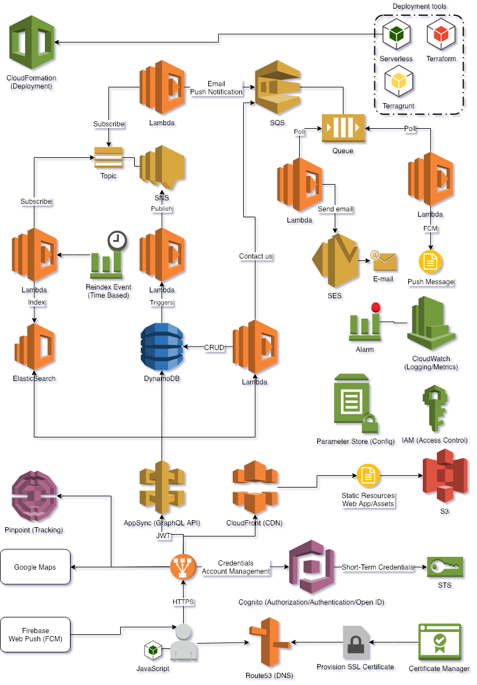

# Things Todo serverless

Backend side of the things todo app which let you find events and activites for kids. It does work, but it's not a production ready solution - it lacks, for instance, a proper error handling and DLQ setup.

## Getting Started

For building and deploying you need a [Serverless framework](https://serverless.com/). This project also depends on AWS infrastructure set up by [ttd_infra](https://github.com/mjedrasz/ttd_infra).

### Prerequisites

* serverless framework
* AWS infrastructure ([ttd_infra](https://github.com/mjedrasz/ttd_infra))
  
### Deploying

The project is organized by services and monorepo approach has been used. However, the GraphQL API cannot be split and be part of the services, so it's deployable as one unit (in fact there are 4 different APIs for different actors, namely organisers, authenticated users, guests and audit).

Each module is deplyoyable by the following command
```
sls --stage test deploy
```
where stage is the name of the environement you want to deploy into.
You can also deploy only individual functions
```
sls --stage test deploy -f <function_name_here>
```
or update lambda function configuration
```
sls --stage test deploy -f <function_name_here> --update-config
```

### Destroying environment

To remove all services execute the following command
```
sls --stage test remove
```

#### Elasticsearch setup

Elasticsearch requires an additional step after setting up a domain (done by [ttd_infra](https://github.com/mjedrasz/ttd_infra)).

Elasticsearch analyzers and mappings need to be setup. You can do that by invoking *esThingsToDoSetup* function.

```
services/search>sls --stage test invoke -f esThingsToDoSetup -l
```

A convenience lambda function for deleting indices is also provided - *esDeleteIndices*

## Tests

Most of the tests are integraiton tests and require AWS environment (The tests assume the targeting services/servers are available during the test - they don't start these services themselves). You can use a real AWS cloud (but be aware of the costs) or you can start up a mock/local server to mimic AWS environment. It has been tested against [Localstack](https://github.com/localstack/localstack) and [DynamoDB Local](https://docs.aws.amazon.com/amazondynamodb/latest/developerguide/DynamoDBLocal.html). However a local Elasticsearch was also needed, because [Localstack](https://github.com/localstack/localstack) didn't support Elasticsearch 7+ format yet. The services used by tests are:

* DynamoDB
* Elasticsearch
* SQS
* SNS
* SES
  
### Setting up test environement

The easiest way to setup a testing environment is by using docker, e.g. to setup [Localstack](https://github.com/localstack/localstack) with DynamoDB, SQS, SNS and SES ports exposed call the following command

```
docker run -d --name localstack -p 4575:4575 -p 4576:4576 -p 4579:4579 -p 4569:4569 localstack/localstack
```

To start a local Elasticsearch instance 
```
docker run -d --name elasticsearch -p 9200:9200 -p 9300:9300 -e "discovery.type=single-node" docker.elastic.co/elasticsearch/elasticsearch:7.5.0
```

Elasticsearch setup is automatically done by the tests. However, DynamoDB requires a manual step to set up tables (it could be automated, but I store DynamoDB schema/index information in terraform). The following command sets up DynamoDB tables and indices based on a terraform configuration.

```
ttd_infra/non-prod/local/dynamoDb>terragrunt apply
```

### Running the tests

To run tests type
```
npm test -- --runInBand
```

Due to non transactional nature of the DynamoDB it's important to execute tests sequentially (*runInBand* flag), so the tests don't intefere with each other.

## Architecture

The project (this and [ttd_terraform](https://github.com/mjedrasz/ttd_terraform)/[ttd_infra](https://github.com/mjedrasz/ttd_infra) duo) consists of several AWS lambda functions and AWS services.
* Cognito - authentication and authorization
* AppSync - managed GraphQL service
* Elasticsearh service - managed Elasticsearch
* Route 53 - DNS
* S3 - serving static assets and hosting web app
* SES - sending e-mails
* CloudWatch - logs, alarms and triggers
* SNS - pub/sub messaging
* SQS - queue service

All services but Elasticsearch follow serverless paradigm. The high-level architecture of the project is presented below.



### Single table design

My first iteration of the DynamoDB tables design closely resembled a familar relational data model, i.e. each entity type had it's own table. It did work, but it 'wasted' precious read/write capacities. Then I came accross this fantastic [Advanced Design Patterns for DynamoDB](https://www.youtube.com/watch?v=HaEPXoXVf2k&feature=youtu.be) talk and read, in the oficial AWS Best practices [guidelines](https://docs.aws.amazon.com/amazondynamodb/latest/developerguide/bp-modeling-nosql.html), the following note
> In general, you should maintain as few tables as possible in a DynamoDB application. Most well-designed applications require only one table. (...) A single table with inverted indexes can usually enable simple queries to create and retrieve the complex hierarchical data structures required   by your application.

I found the single table design with overloaded indices interesting and gave it a try (However, I do think it focuses mostly on one dimension only, i.e. cost efectivness, and makes other things harder, e.g. code maintenance, data extraction. Additionally, the new, on-demand, payment scheme alleviates that need - you don't "see" read/write capacities anymore).

I ended up with the following design.

| id    | sk (gsi1pk) | gsi1sk                  | ... other attributes |
| ----- | ----------- | ----------------------- | -------------------- |
| usrId | USR         |                         |                      |
| ttdId | TTD         | STATUS#orgId            |                      |
| chlId | CHL#usrId   | STATUS                  |                      |
| ttdId | FAV#usrId   | STATUS                  |                      |
| bkgId | BKG         | STATUS#usrId#date#ttdId |                      |

The indentified access patterns are as follows

| access pattern                                        | index      | conditions                                         | dynamoDb operation |
| ----------------------------------------------------- | ---------- | -------------------------------------------------- | ------------------ |
| get user profile                                      | main table | id = :usrId and sk = "USR"                         | GetItem            |
| get thing todo by id                                  | main table | id = :usrId and sk = "TTD"                         | GetItem            |
| get all my drafts                                     | gsi-1      | sk = 'TTD' and gsi1sk = "DRAFT#orgId"              | Query              |
| get all my published                                  | gsi-1      | sk = 'TTD' and gsi1sk = "PUBLISHED#orgId"          | Query              |
| get all my rejected                                   | gsi-1      | sk = 'TTD' and gsi1sk = "REJECTED#orgId"           | Query              |
| get pending things todo                               | gsi-1      | sk = 'TTD' and begins_with(gsi1sk, "PENDING")      | Query              |
| get child by id                                       | main table | id = :chlId and sk = "CHL#usrId"                   | GetItem            |
| get all my children                                   | gsi-1      | sk = "CHL#usrId" and gsi1sk = "ACTIVE"             | Query              |
| get my favorite by id                                 | main table | id = :ttdId and sk = "FAV#usrId"                   | GetItem            |
| get all my favorites                                  | gsi-1      | sk = "FAV#usrId" and gsi1sk = "ACTIVE"             | Query              |
| get all things todo by ids (avoid N+1 select problem) | main table | id = :ttdId and sk = "TTD"                         | GetBatchItem       |
| get all organisers by ids (avoid N+1 select problem)  | main table | id = :usrId and sk = "USR"                         | GetBatchItem       |
| get booking by id                                     | main table | id = :bkgId and sk = "BKG"                         | GetItem            |
| get all my bookings (user)                            | gsi-1      | sk = "BKG" and begins_with(gsi1sk, "ACTIVE#usrId") | Query              |

_Note_: to accomodate queries needed by organisers to handle bookings (not included in the current design) an additional global index would have to be introduced.

## Troubleshooting

[Serverless framework](https://serverless.com/) is de-facto AWS CloudFormation wrapper. In case of errors it is often easier to find a root cause of the problem in the AWS CloudFormation console.

### Debug

Running serverless commands in a debug and verbose mode
```
SLS_DEBUG=* sls --stage test deploy --verbose
```

## Acknowledgments

* *Production-Ready Serverless* online course on Safari by Yan Cui
* fanout *blockify* function based on [aws-lambda-fanout](https://github.com/aws-samples/aws-lambda-fanout)

## License

This project is licensed under the MIT License - see the [LICENSE.MD](LICENSE.MD) file for details


